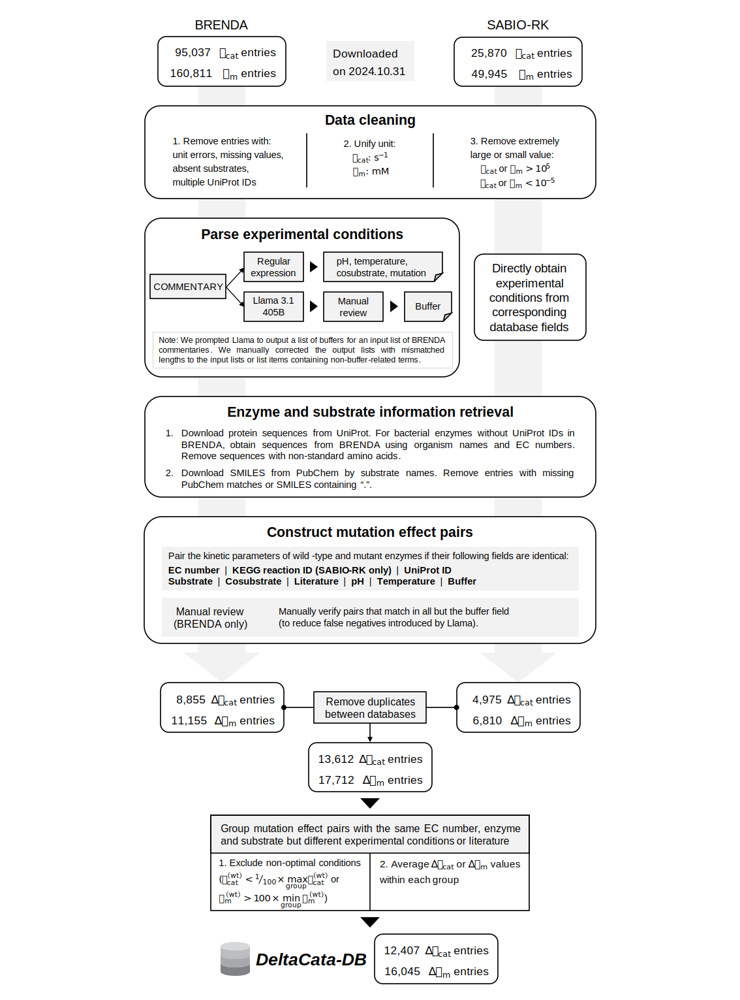

# DeltaCata-DB
We collected *k*~cat~ and *K*~m~ entries from BRENDA and SABIO-RK. Then, the Llama language model and regular expressions were applied to extract experimental conditions (pH, temperature and buffer) from unstructured texts, followed by careful manual review to ensure accuracy. A mutation effect entry was constructed by pairing wild-type and mutant kinetic parameters from the same enzymatic reaction conducted under identical experimental conditions.


## Requirements
To run the data collection pipeline, you need to install the following additional packages (on top of the main project's environment):
```
pip install requests
pip install zeep
pip install beautifulsoup4
pip install pubchempy
pip install numpy
pip install lxml
pip install html5lib
```

## Usage

Run the notebooks in order:

`01Download and preprocess BRENDA data.ipynb`   
Download BRENDA records and perform cleaning and normalization.

`02Download and preprocess SABIO-RK data.ipynb`   
Fetch SABIO-RK entries and apply similar preprocessing.

`03Remove duplicates between databases.ipynb`   
Merge the two databases and remove duplicates.

Tips:   
1. Ensure network availability for external data resources (BRENDA, SABIO-RK).
2. We used Llama 3.1 405B language model to parse buffer information from the free‑text "COMMENTARY" field in BRENDA, followed by careful manual review to ensure accuracy. Please refer to our paper for more details of the manual process.