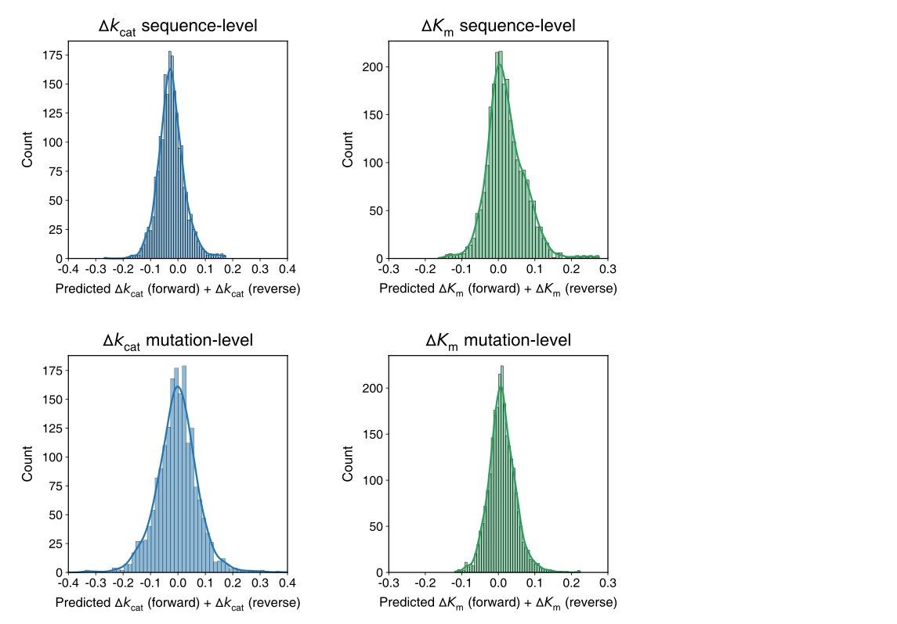

# Refined fine-tuning strategy for model anti-symmetry
Model anti-symmetry is a highly desirable property for mutation effect predictors, ensuring that the predicted kinetic parameter change of a forward mutation is the exact inverse of its hypothetical reverse mutation. In DeltaCata, perfect anti-symmetry is not inherently guaranteed by the network architecture. To mitigate this, we fine-tuned the network on both forward and hypothetical reverse mutations using a smaller, empirically chosen learning rate of 1 $\times$ 10-6 for at most 15 epochs. However, further evaluation revealed that this strategy resulted in a performance discrepancy between forward and reverse predictions on $\Delta$*k*cat (see our paper for more details).

To better account for model anti-symmetry, we implemented a more rigorous fine-tuning protocol, in which we optimized the learning rate by monitoring the average prediction performance on both forward and hypothetical reverse mutations in the validation set. Finally, a learning rate of 1 $\times$ 10-4 was selected (identical to the original learning rate adopted during training). As shown in the table below, fine-tuning with this updated learning rate ensured that the forward prediction accuracy remained highly robust while improving the reverse prediction performance, thereby effectively minimizing the gap between the two directions. Furthermore, an analysis of the refined model confirmed its strong anti-symmetry, as the sums of the predicted values for forward and hypothetical reverse mutations on the test sets tightly centered around zero (see the figure below). 

### Performance of DeltaCata predictions for forward and hypothetical reverse mutations

| Dataset | Split | PCC (Forward mutations) | PCC (Reverse mutations) |
| :--- | :--- | :--- | :--- |
| $\Delta$*k*cat | Sequence-level | 0.571 | 0.564 |
| | Mutation-level | 0.712 | 0.700 |
| $\Delta$*K*m | Sequence-level | 0.367 | 0.358 |
| | Mutation-level | 0.631 | 0.625 |

### Anti-symmetry analysis of DeltaCata

