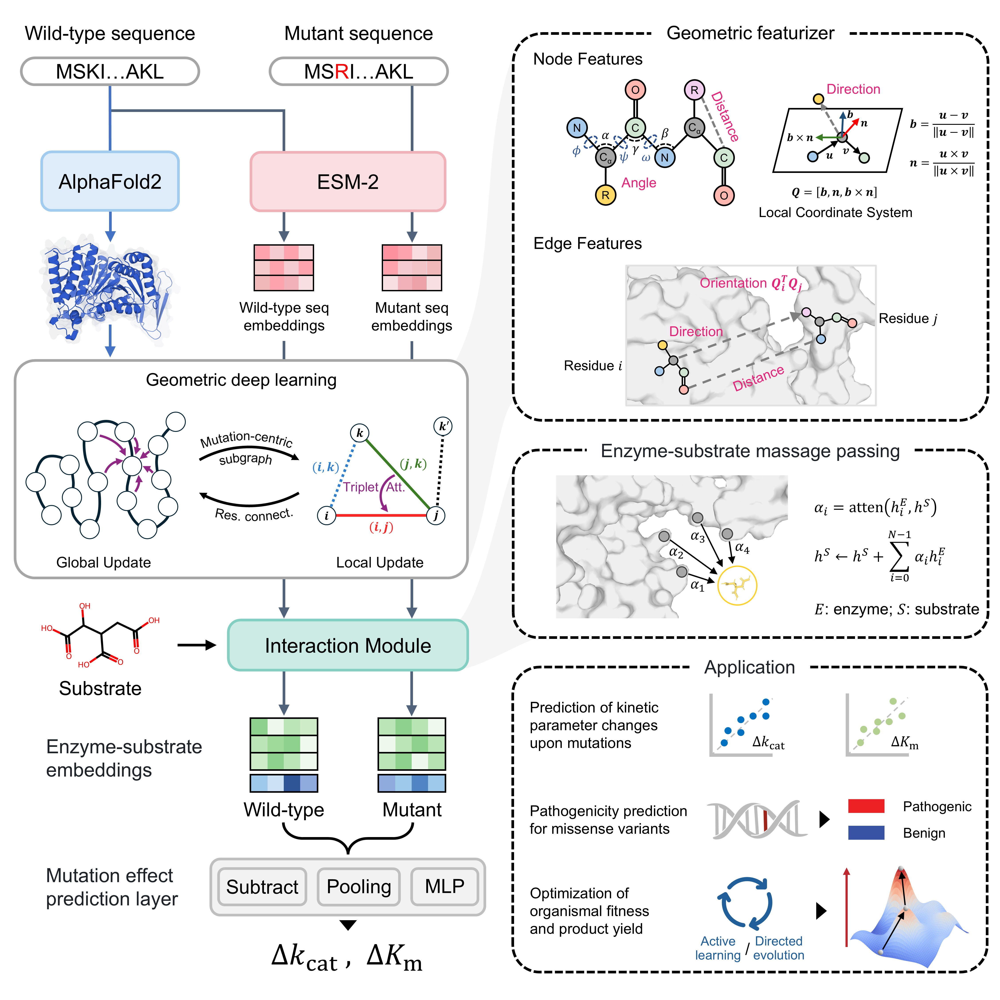

# DeltaCata
DeltaCata is a siamese geometric graph neural network for direct predictions of enzyme kinetic parameter changes upon residue substitutions ($\Delta$*k*~cat~ and $\Delta$*K*~m~). DeltaCata is easy to install and run, and is also fast and accurate (surpassing state-of-the-art kinetic parameter predictors and general-purpose protein design models). 


## 📖 Table of Contents
- [Local Installation](#local-installation)
   - [Requirements](#requirements)
   - [Inference](#inference)
   - [Reproducibility](#reproduce)
- [Data Collection](#data-collection)
- [License](#license)
- [Citation and Contact](#citation)

## 💻 Local Installation <a name="local-installation"></a>

To run DeltaCata on a local machine, please follow the instructions below.

### 📦 Requirements <a name="requirements"></a>
```
conda create --name DeltaCata python=3.8
conda install pytorch==2.2.0 torchvision==0.17.0 torchaudio==2.2.0 pytorch-cuda=11.8 -c pytorch -c nvidia
pip install pandas
pip install fair-esm
pip install tqdm
pip install biopython

pip install torch-scatter -f https://pytorch-geometric.com/whl/torch-2.2.0+cu118.html
pip install torch-sparse -f https://pytorch-geometric.com/whl/torch-2.2.0+cu118.html
pip install torch-cluster -f https://pytorch-geometric.com/whl/torch-2.2.0+cu118.html
pip install torch-spline-conv -f https://pytorch-geometric.com/whl/torch-2.2.0+cu118.html
pip install torch-geometric

pip install rdkit
```


### 🔍 Inference <a name="inference"></a>
This project supports two inference modes:

1. User-specified mutations (see `input_json/example.json`).
2. In silico deep mutational scanning (see `input_json/example_dms.json`).

Both modes require a protein sequence, a substrate SMILES string, and the corresponding PDB file path.

```
cd Inference/

# Mode 1: specified mutations (example.json)
python inference.py --input input_json/example.json

# Mode 2: deep mutational scanning (example_dms.json)
python inference.py --input input_json/example_dms.json
```

**Required fields for input json:**  
* sequence: string; wild-type amino acid sequence.
* SMILES: string; SMILES of the substrate.
* pdb_path: string; path to the wild-type PDB file.
* mutant: string; in mode 1, ";" is used to separate different mutants, while "," is used to separate multiple mutated sites in a multiple-point mutant.

### 🔁 Reproducibility <a name="reproduce"></a>
Using the splits in `Dataset/test_dataset/` and protein structures in `Dataset/test_pdbs/`, the following pipeline reproduces the reported results.
```
cd Inference
bash reproduce.bash
```


## 📊 Data Collection <a name="data-collection"></a>
We curated data of mutation-induced changes in enzyme kinetic parameters ($\Delta$*k*~cat~ and $\Delta$*K*~m~) from BRENDA and SABIO-RK. The pipeline for constructing the DeltaCata-DB dataset is provided in `Data_collection/`.

For quick use, ready-to-use datasets are available in `Dataset/` as `delta_kcat.csv` and `delta_km.csv`. 


<!-- ## 🙏 Acknowledgements <a name="acknw"></a>
xxx -->

## 📄 License <a name="license"></a>
The source code of DeltaCata is licensed under the Attribution-NonCommercial-NoDerivatives 4.0 International license given in the `LICENSE` file.

## 🗞️ Citation and Contact <a name="citation"></a>
Citation: Coming soon.


Contact:  
Qianmu Yuan (yuanqm3@mail3.sysu.edu.cn)  
Yuedong Yang (yangyd25@mail.sysu.edu.cn)